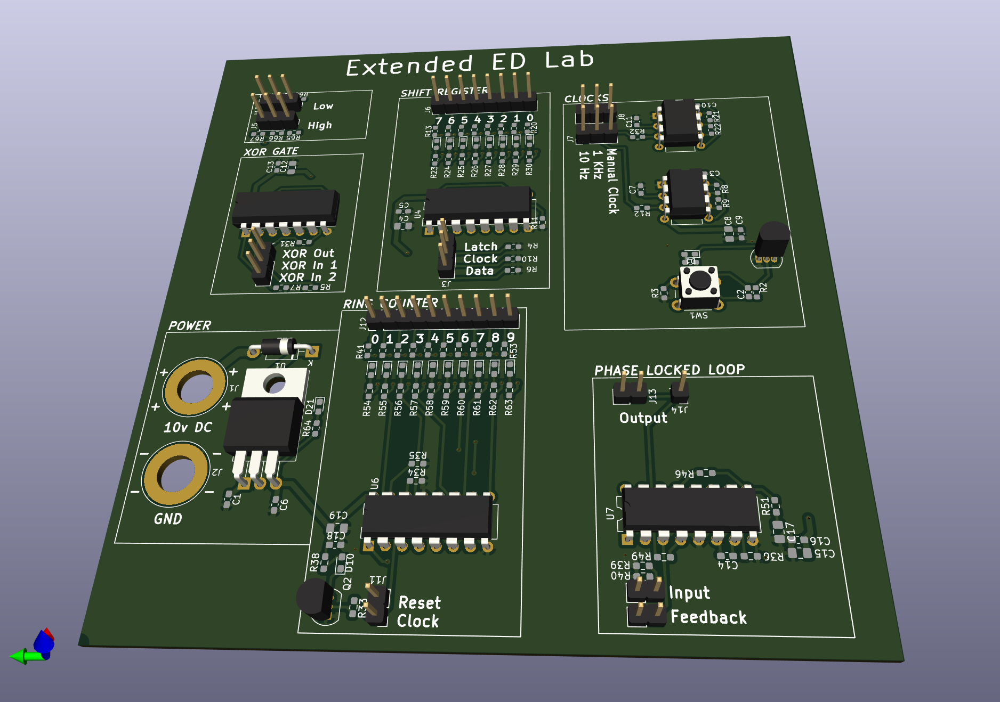

# Extended Digital Electronics laboratory

This laboratory is intended to be used as teaching material for the 6th Digital Electronics laboratory in the Faculty of Computer Science, Politehnica University of Bucharest.

This laboratory material presents the functioning of a shift register, a ring counter and a phase-locked loop. The following applications can be built:

 * A semaphore-like appliance using a ring counter
 * A clock divider
 * Phase-locked loop used to correct the pulse width of a fixed-frequency input signal
 * Clock multiplier bult using the phase-locked loop and clock divider
 * Linear feedback shift register - a random number generator using the shift register and XOR gate

## Version v0.1

A batch of 10 boards v0.01 were built. Seven of them were populated and tested in field, while three were kept for archieval purposes.

After teaching the extended laboratory to two groups, the following observations can be made:

 * Replace the XOR gate with a XNOR gate to eliminate the need to seed the LFSR. A XNOR gate would allow it to be self-seeding.
 * There are missing traces near the shift registers that need to be drawn. This issue was fixed by hand using wire on the first batch
 * Remove R36 to allow a much more dynamic range for the PLL.
 * Add LED to all clock inputs to allow better observation of the circuit.
 * Add reverse-polarity protection.

These flaws are planned to be fixed in version v0.2.

